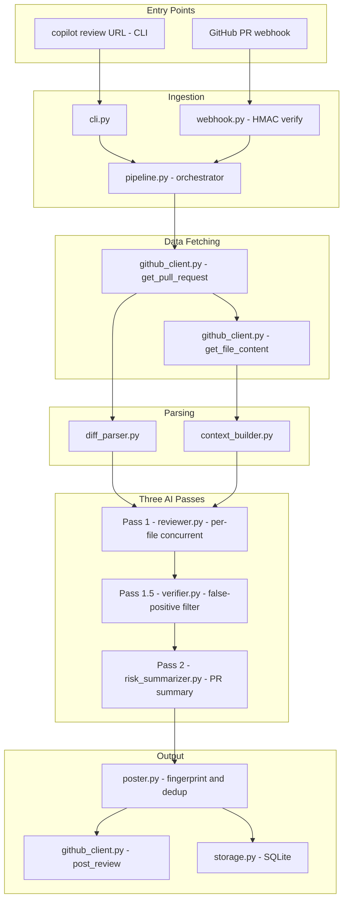
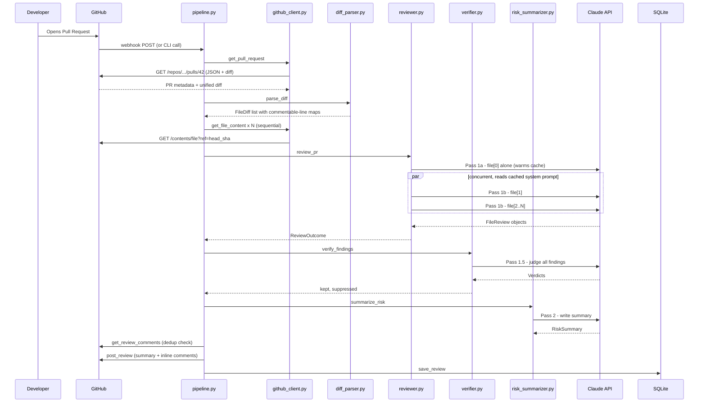

# Code Review Copilot — Engineering Handbook

> **Audience:** A new engineer joining the team. Assumes general programming knowledge but zero familiarity with this codebase.

---

## Table of Contents

1. [What Are We Building?](#1-what-are-we-building)
2. [System Architecture](#2-system-architecture)
3. [Repository Layout](#3-repository-layout)
4. [Configuration — config.py](#4-configuration--configpy)
5. [Data Contracts — models.py](#5-data-contracts--modelspy)
6. [GitHub Integration — github_client.py](#6-github-integration--github_clientpy)
7. [Diff Parsing — diff_parser.py](#7-diff-parsing--diff_parserpy)
8. [File Context — context_builder.py](#8-file-context--context_builderpy)
9. [AI Integration Deep Dive](#9-ai-integration-deep-dive)
10. [The Reviewer — reviewer.py](#10-the-reviewer--reviewerpy)
11. [The Verifier — verifier.py](#11-the-verifier--verifierpy)
12. [Risk Summarizer — risk_summarizer.py](#12-risk-summarizer--risk_summarizerpy)
13. [Prompts — prompts.py](#13-prompts--promptspy)
14. [Convention Learning — conventions.py](#14-convention-learning--conventionspy)
15. [The Pipeline — pipeline.py](#15-the-pipeline--pipelinepy)
16. [Comment Rendering & Dedup — poster.py](#16-comment-rendering--dedup--posterpy)
17. [Persistence — storage.py](#17-persistence--storagepy)
18. [Webhook Server — webhook.py](#18-webhook-server--webhookpy)
19. [CLI — cli.py](#19-cli--clipy)
20. [Dashboard — dashboard/app.py](#20-dashboard--dashboardapppy)
21. [Async Programming Primer](#21-async-programming-primer)
22. [Security Architecture](#22-security-architecture)
23. [Performance & Cost Optimisation](#23-performance--cost-optimisation)
24. [Testing Strategy](#24-testing-strategy)
25. [Error Handling Philosophy](#25-error-handling-philosophy)
26. [Design Decisions & Tradeoffs](#26-design-decisions--tradeoffs)
27. [Complete End-to-End Request Lifecycle](#27-complete-end-to-end-request-lifecycle)
28. [Developer Runbook](#28-developer-runbook)

---

## 1. What Are We Building?

### The Human Problem

Software teams use **Pull Requests (PRs)** as the gate through which all code changes flow before merging. Every PR should be reviewed by a human engineer — but this is expensive. A thorough review takes 30–60 minutes. As teams grow, review queues grow faster than review capacity.

### What the Copilot Does

The **Code Review Copilot** is an AI agent that acts as an always-available senior engineer. It:

- Posts **inline comments** directly on changed lines in GitHub, with severity labels, plain-English explanations, and one-click suggested fixes.
- Writes a **PR-level risk summary** (quality score /100, merge recommendation, highest-risk changes).
- **Learns your team's unwritten conventions** from past merged PRs and enforces them automatically.
- Runs a **false-positive filter** (a second AI pass that suppresses noise before posting).
- **Deduplicates**: if the same PR is re-reviewed after a new commit, findings already posted are never re-posted.

### What Makes This Production-Grade

| Feature | Implementation |
|---|---|
| Structured AI output | Anthropic structured outputs via Pydantic schemas |
| Parallel file reviews | `asyncio.gather` with semaphore |
| Cost optimisation | Anthropic prompt caching (~90% cheaper per file after first) |
| Guaranteed line attribution | Numbered diff + commentable-line map + anchor snapping |
| Idempotent re-reviews | SHA-256 fingerprint hidden in every comment |
| False-positive filter | Adversarial second AI pass |
| Webhook security | HMAC-SHA256 signature verification |
| Zero-setup persistence | SQLite via standard library |

---

## 2. System Architecture

### High-Level Diagram



### The Three-Pass AI Design

The system makes three sequential AI calls. Understanding *why* is fundamental:

**Pass 1 — Reviewer (coverage-first):** Claude is told to report *everything* including low-confidence findings. "A downstream step filters." This maximises recall — missing a real bug is worse than a false positive at this stage.

**Pass 1.5 — Verifier (precision filter):** A second, sceptical Claude prompt receives all Pass 1 findings and the original diffs. It votes keep/suppress on each finding. This kills noise before anything reaches the developer.

**Pass 2 — Risk Summariser (synthesis):** A third Claude prompt writes the PR-level executive summary: quality score, highest-risk changes, merge recommendation.

### Complete Data Flow



---

## 3. Repository Layout

```
reviewbot/
├── .env.example              # Template — copy to .env, fill secrets
├── .env                      # NEVER committed; read by pydantic-settings
├── pyproject.toml            # Package metadata, dependencies, entry-point
├── Dockerfile
├── README.md
├── TESTING.md
│
├── src/
│   └── copilot/              # The Python package (import as `copilot`)
│       ├── __init__.py       # Version string
│       ├── config.py         # Settings singleton via pydantic-settings
│       ├── models.py         # Pydantic schemas — AI contracts + DB objects
│       ├── prompts.py        # All system prompt strings
│       ├── github_client.py  # GitHub REST API (read + write)
│       ├── diff_parser.py    # Unified diff → FileDiff + commentable-line map
│       ├── context_builder.py # Fetches full file at head SHA
│       ├── reviewer.py       # Pass 1: concurrent per-file Claude review
│       ├── verifier.py       # Pass 1.5: false-positive suppression
│       ├── risk_summarizer.py # Pass 2: PR-level RiskSummary
│       ├── conventions.py    # `copilot learn`: extract team rules
│       ├── pipeline.py       # Main orchestrator
│       ├── poster.py         # Comment rendering + fingerprint dedup
│       ├── storage.py        # SQLite persistence
│       ├── webhook.py        # FastAPI webhook server
│       └── cli.py            # Typer CLI
│
├── dashboard/
│   └── app.py               # Streamlit dashboard
│
└── tests/
    ├── conftest.py           # FakeClaude fixture, make_pr helper
    ├── test_diff_parser.py
    ├── test_reviewer.py
    ├── test_verifier.py
    ├── test_pipeline.py
    ├── test_poster.py
    ├── test_webhook.py
    └── ... (14 test files total)
```

**Why `src/` layout?** Prevents the local code directory from being accidentally imported instead of the installed package. Forces `pip install -e .` before any imports work. Eliminates "works on my machine" bugs caused by importing stale local code in tests.

---

## 4. Configuration — `config.py`

### Why Configuration Needs Its Own File

Scattering `os.getenv("MY_KEY")` throughout the codebase is an anti-pattern. It makes it impossible to see all configuration at a glance, impossible to validate at startup, and impossible to provide good defaults.

### Pydantic Settings — First Principles

**Pydantic** is a library that validates data at runtime using Python type annotations. `pydantic-settings` extends this to read from environment variables and `.env` files automatically.

```python
# Without Pydantic — danger
port = os.getenv("PORT")      # might be None!
connect(port)                  # crashes cryptically

# With Pydantic Settings — safe
class Settings(BaseSettings):
    port: int = 8000           # validated as integer; defaults to 8000 if missing
settings = Settings()
connect(settings.port)         # guaranteed to be an int
```

### The `Settings` Class — Line by Line

```python
class Settings(BaseSettings):
    model_config = SettingsConfigDict(env_file=".env", extra="ignore")
```

- `env_file=".env"` — reads the `.env` file in the current working directory.
- `extra="ignore"` — silently ignores unknown keys (e.g., `NVIDIA_API_KEY` from another project).

```python
    anthropic_api_key: str = ""
    github_token: str = ""
    github_webhook_secret: str = ""
```

These map to env vars `ANTHROPIC_API_KEY`, `GITHUB_TOKEN`, `GITHUB_WEBHOOK_SECRET`. Defaults are empty strings — the app doesn't crash on startup if a key is missing; individual modules check for presence.

```python
    copilot_model: str = "claude-opus-4-8"
    max_file_diff_chars: int = 60_000
    max_context_chars: int = 30_000
    max_concurrent_reviews: int = 4
    verify_findings: bool = True
```

These are tuning knobs. `verify_findings = False` skips the verifier (useful for debugging raw AI output).

```python
@lru_cache
def get_settings() -> Settings:
    return Settings()
```

`@lru_cache` makes `Settings` a singleton — the `.env` file is read exactly once. Always call `get_settings()` rather than instantiating `Settings()` directly. In tests, call `get_settings.cache_clear()` after mutating environment variables with `monkeypatch`.

### Common Bugs

- **Settings not picking up `.env` changes** — `lru_cache` holds the old object. Restart the process.
- **Test bleeding** — a test sets an env var, gets cached, next test sees wrong value. The `tmp_db` fixture in `conftest.py` calls `get_settings.cache_clear()` before and after to prevent this.

---

## 5. Data Contracts — `models.py`

### Why Pydantic Models for AI Output?

LLMs return plain text. Your application needs structured data to post a comment on a specific line number. The naive approach — parsing the text with regex — breaks every time the model rephrases.

**Structured Outputs** solve this: pass a JSON Schema to the API, and the model is constrained to return JSON that matches the schema. Pydantic generates the JSON Schema from your class definition automatically.

### Teaching Pydantic

```python
from pydantic import BaseModel, Field

class Person(BaseModel):
    name: str
    age: int = 0                # optional with default

p = Person(name="Alice", age=30)
print(p.name)  # "Alice"
Person(name="Bob", age="not a number")  # raises ValidationError immediately
```

The `Field(description="...")` metadata is not just documentation — it is included in the JSON Schema sent to Claude and becomes a prompt instruction.

### The `Severity` Type

```python
Severity = Literal["bug", "security", "performance", "style", "suggestion"]
```

`Literal` means "exactly one of these values." In JSON Schema this becomes an `enum`. Claude cannot return any other string.

### The `Finding` Model — Most Important Class

```python
class Finding(BaseModel):
    file: str = Field(description="Path of the file exactly as it appears in the diff header.")
    line: int = Field(
        description=(
            "Line number in the NEW version of the file. Must be one of the "
            "numbered lines shown in the diff — never a line outside the diff."
        )
    )
    severity: Severity
    title: str = Field(description="One-line summary of the problem, max 80 chars.")
    issue: str
    why_it_matters: str = Field(
        description="Plain-English explanation for a junior developer..."
    )
    suggested_fix: str = Field(
        description="Concrete replacement code for the flagged line(s) only."
    )
    confidence: Literal["high", "medium", "low"]
```

Every `description` is an AI instruction. The `line` description is critical: it tells Claude to copy the number it sees on the page (from the numbered diff), not count lines from scratch.

### The `RiskSummary` Model

```python
class RiskSummary(BaseModel):
    quality_score: int = Field(ge=0, le=100)     # ge = greater-or-equal, le = less-or-equal
    overall_assessment: str
    highest_risk_changes: list[str]
    merge_recommendation: Literal["approve", "approve_with_nits", "request_changes", "block"]
    rationale: str
```

`ge=0, le=100` enforces the range in both Pydantic validation and the JSON Schema Claude sees.

### The `ReviewResult` — Persistence Object

```python
class ReviewResult(BaseModel):
    repo: str
    pr_number: int
    pr_title: str
    findings: list[Finding]
    suppressed: list[Finding] = []
    skipped_duplicates: int = 0
    summary: RiskSummary
    model: str
    input_tokens: int = 0
    cached_tokens: int = 0
    output_tokens: int = 0
```

`result.model_dump_json()` serialises the entire object — including nested lists of `Finding` — to a JSON string for SQLite storage. Zero boilerplate.

---

## 6. GitHub Integration — `github_client.py`

### REST API Background

GitHub exposes all its data via a REST API. Every resource is a URL, and you interact with it using HTTP methods:

| Method | Action | Example |
|---|---|---|
| GET | Read | Get PR details |
| POST | Create | Post a review |

Authentication uses a **Personal Access Token (PAT)** — a long string sent in every request header: `Authorization: Bearer ghp_...`.

### The `GitHubClient` Class

It is a **context manager** — use it with `with GitHubClient() as gh:`. This guarantees the underlying HTTP connection is closed, even if an exception occurs.

**Constructor:**
```python
self._client = httpx.Client(
    base_url="https://api.github.com",
    headers={
        "Authorization": f"Bearer {token}",
        "Accept": "application/vnd.github+json",
        "X-GitHub-Api-Version": "2022-11-28",
    },
    timeout=30.0,
    follow_redirects=True,
)
```

- `httpx` is a modern HTTP client (like `requests` but with async support).
- `timeout=30.0` — without this, a hung GitHub API call blocks forever.
- `X-GitHub-Api-Version` pins to a specific version so GitHub API changes don't break us.

### `get_pull_request` — Two Requests to One URL

```python
meta = self._get(f"/repos/{owner}/{repo}/pulls/{number}")        # JSON
diff = self._get_text(f"/repos/{owner}/{repo}/pulls/{number}",
                      accept="application/vnd.github.v3.diff")   # raw diff
```

The same URL returns different formats based on the `Accept` header. There is no single request that returns both metadata and diff — two requests are required.

`head_sha = meta["head"]["sha"]` is the commit SHA at the tip of the PR branch. Used in `context_builder.py` to fetch the file *at the exact commit* the PR is at — not the current `main`, which might be ahead.

### Pagination — `_get_paginated`

GitHub list endpoints return at most 100 items per page. A long-lived PR can have hundreds of comments.

```python
def _get_paginated(self, path):
    params = {"per_page": 100}
    items = []
    url = path
    next_params = params
    while url:
        resp = self._client.get(url, params=next_params)
        resp.raise_for_status()
        items.extend(resp.json())
        url = resp.links.get("next", {}).get("url")   # RFC 5988 Link header
        next_params = None      # subsequent URLs already carry their params
    return items
```

GitHub includes a `Link: <...>; rel="next"` header when there are more pages. `httpx` parses this into `resp.links`. `next_params = None` on subsequent iterations prevents re-adding query params the URL already contains.

### The 422 Fallback in `post_review`

Between fetching the diff and posting the review, the author might push another commit. A line in our diff might no longer be in GitHub's current diff. GitHub returns HTTP 422.

```python
if resp.status_code == 422 and comments:
    # Retry without inline comments — embed them in the summary body instead
    resp = self._client.post(..., json={"body": body + _fallback_comments_md(comments)})
```

Findings are not lost — they're appended as markdown in the review body. On a later re-review, `get_review_summary_bodies()` finds their fingerprints and skips re-posting.

### Common Bugs

- **401 Unauthorized** — `GITHUB_TOKEN` wrong or missing.
- **403 Forbidden** — Token lacks required scopes (`repo` classic, or `Pull requests: Read/Write` fine-grained).
- **422 Unprocessable Entity** — Line not in current diff (handled by fallback).

---

## 7. Diff Parsing — `diff_parser.py`

### What Is a Unified Diff?

When code changes, Git records a **unified diff** — a compact format showing what was added and removed:

```diff
@@ -1,2 +1,4 @@
 def add(a, b):
-    return a + b
+    return a - b
+
+result = eval(user_input)
```

| Prefix | Meaning |
|---|---|
| ` ` (space) | Context line — unchanged, shown for reference |
| `-` | Removed from old file |
| `+` | Added to new file |
| `@@ -1,2 +1,4 @@` | Hunk header: old file line 1, 2 lines shown; new file line 1, 4 lines shown |

### The Line Attribution Problem

GitHub only lets you post comments on lines **visible in the diff** (added + context lines). If you try to comment on a removed line or a line not in the diff, GitHub returns 422. Additionally, line numbers must refer to the **new** version of the file.

When Claude reviews code it might say "bug on line 42" — but which line 42? Old file? New file? Is it even in the diff?

### Two-Part Solution

**Part 1: Number the diff lines.** Before sending to Claude, we annotate every line with its new-file number:

```
   1 |  def add(a, b):
     | -    return a + b
   2 | +    return a - b
   3 | +
   4 | +result = eval(user_input)
```

The system prompt tells Claude: "copy the number you see on the page — never estimate." This is the single most important trick for accurate attribution.

**Part 2: Commentable-line map + anchor snapping.** We build `commentable_lines: set[int]` of every new-file line number GitHub will accept. Every finding is validated against this set. Near-misses (within ±3 lines) are snapped to the nearest valid line. Un-anchorable findings are dropped.

### `parse_diff` — Line by Line

```python
def parse_diff(diff_text: str) -> list[FileDiff]:
    patch = PatchSet.from_string(diff_text)   # unidiff library
    files = []
    for pf in patch:
        fd = FileDiff(path=pf.path, is_new=pf.is_added_file, is_deleted=pf.is_removed_file)
        rendered = [f"--- {pf.source_file}", f"+++ {pf.target_file}"]
        for hunk in pf:
            rendered.append(f"@@ -{hunk.source_start},{hunk.source_length} ...")
            for line in hunk:
                if line.is_added:
                    fd.commentable_lines.add(line.target_line_no)
                    fd.added_lines.add(line.target_line_no)
                    rendered.append(f"{line.target_line_no:>5} | +{line.value.rstrip()}")
                elif line.is_context:
                    fd.commentable_lines.add(line.target_line_no)
                    rendered.append(f"{line.target_line_no:>5} |  {line.value.rstrip()}")
                else:  # removed — no new-file line number
                    rendered.append(f"      | -{line.value.rstrip()}")
        fd.numbered_diff = "\n".join(rendered)
        files.append(fd)
    return files
```

`{line.target_line_no:>5}` right-aligns the number in a 5-char field — consistent formatting helps Claude read numbers reliably.

### `anchor_line`

```python
def anchor_line(file_diff: FileDiff, line: int) -> int | None:
    if line in file_diff.commentable_lines:
        return line                    # exact match — fast path
    candidates = [n for n in file_diff.commentable_lines if abs(n - line) <= 3]
    if candidates:
        return min(candidates, key=lambda n: abs(n - line))  # nearest within ±3
    return None  # un-anchorable — finding will be dropped
```

The ±3 window handles common LLM off-by-one errors. Too small: valid findings dropped. Too large: snapped to completely wrong lines.

---

## 8. File Context — `context_builder.py`

### Why Context Beyond the Diff?

The diff only shows what changed. But understanding *why* a change is wrong often requires seeing the whole file. Example:

```diff
+    result = process(data)
```

Is this wrong? Without context we can't tell. But if the full file shows `process()` can return `None`, and the next line calls `result.strip()`, the bug is obvious.

### `build_file_context`

```python
def build_file_context(client: GitHubClient, pr: PullRequest, file_diff: FileDiff) -> str:
    if file_diff.is_deleted:
        return "(file deleted in this PR)"
    content = client.get_file_content(pr.owner, pr.repo, file_diff.path, pr.head_sha)
    if content is None:
        return "(file content unavailable — binary or too large)"
    if len(content) > settings.max_context_chars:
        head = content[:settings.max_context_chars]
        return f"{head}\n... (truncated, file is {len(content)} chars)"
    return content
```

- `pr.head_sha` — fetches the file at the exact commit the PR is at, not the current `main`.
- `content is None` when the file is binary or too large for the GitHub API.
- Truncation notice tells Claude the file continues — prevents it from assuming a truncated file is complete.

This runs **synchronously** for all files before the async Claude section begins. The GitHub API is fast (~200ms per file); mixing sync HTTP into the async review loop would add complexity without meaningful benefit.

---

## 9. AI Integration Deep Dive

### What Is an LLM?

A Large Language Model (Claude) takes text as input and produces text as output. The art of **prompt engineering** is crafting input such that the output is reliably useful.

### System Prompt vs. User Prompt

Every Claude API call has two parts:

- **System prompt** — the "personality" and standing instructions. Tells Claude who it is and how to behave. Cached between files for massive cost savings.
- **User prompt** — the specific content for this request (the diff, PR title, file context).

### Structured Outputs — The Key Innovation

Instead of returning free text, Claude is constrained to return JSON that exactly matches our Pydantic schema:

```python
response = await client.messages.parse(
    model=settings.copilot_model,
    system=system,
    messages=[{"role": "user", "content": user_message}],
    output_format=FileReview,    # ← Our Pydantic model
)
parsed = response.parsed_output  # ← Already a FileReview object!
```

The Anthropic SDK generates JSON Schema from `FileReview`, sends it to the API, receives validated JSON, and deserialises it into a Python object. `parsed_output` is `None` only if the model ran out of tokens mid-response.

### The `thinking` Parameter

```python
thinking={"type": "adaptive"},
```

Claude Opus 4 supports extended thinking — the model reasons step-by-step before producing output. `"adaptive"` lets Claude decide when to use it. Thinking uses tokens billed to the caller but not shown in output.

### Prompt Caching — The Cost Multiplier

This is the single most important cost-saving feature.

**The problem:** A 4,000-token system prompt sent to Claude for each of 15 files costs 60,000 input tokens for the system prompt alone.

**Anthropic's cache:** Mark a block with `cache_control: {"type": "ephemeral"}`. For 5 minutes, subsequent requests sending the same bytes read from cache at ~10% of the input token price.

```python
system = [{
    "type": "text",
    "text": REVIEWER_SYSTEM + rules_block(load_rules_json()),
    "cache_control": {"type": "ephemeral"},
}]
```

**The warm-up trick:** The cache entry is only readable *after* the first response that created it. So we review file[0] alone first, then fan out files[1..N] concurrently — they all read the cached prompt at 10% cost.

Result: a 15-file PR pays full price for 1 system prompt and 10% for 14 others. ~80% savings on system prompt tokens.

### Token Usage Tracking

```python
@dataclass
class Usage:
    input_tokens: int = 0
    cached_tokens: int = 0
    output_tokens: int = 0

    def add(self, usage) -> None:
        self.input_tokens += usage.input_tokens
        self.cached_tokens += getattr(usage, "cache_read_input_tokens", 0) or 0
        self.output_tokens += usage.output_tokens
```

A running total accumulates through review → verify → summarise. Final counts are stored in SQLite and shown in the dashboard as estimated API cost.

### Error Handling

```python
except anthropic.APIError as exc:
    on_progress(f"⚠ API error reviewing {fd.path}; skipping")
    return
```

`anthropic.APIError` covers rate limits, server errors, timeouts. Philosophy: **fail partial, not total**. One file failing must not cancel the other 14.

---

## 10. The Reviewer — `reviewer.py`

### Async from First Principles

**Synchronous** code does one thing at a time. If reviewing a file takes 8 seconds, 15 files take 15 × 8s = 120 seconds.

**Asynchronous** code interleaves waiting: while waiting for Claude to respond for file 1, it starts calling Claude for file 2. The total time approaches the time for the slowest single call, not the sum.

Key concepts:
- `async def` — defines a coroutine (a function that can be paused and resumed).
- `await` — pause here and let the event loop run other coroutines.
- `asyncio.gather()` — start multiple coroutines and wait for all to finish.
- `asyncio.Semaphore(n)` — at most `n` coroutines run concurrently (like a nightclub bouncer).

### File Filtering

```python
SKIP_SUFFIXES = (".lock", ".min.js", ".map", ".svg", ".png", ".jpg", ".ico")
SKIP_NAMES = ("package-lock.json", "yarn.lock", "poetry.lock", "uv.lock", "Cargo.lock")
```

Lock files are auto-generated and unreviable. Minified JS is obfuscated. Images have no logical bugs. Skipping them saves tokens and prevents noisy irrelevant findings.

### The Warm-Up + Concurrent Pattern

```python
# Warm the cache with the first file (sequential)
await review_one(files[0])

# Fan out the rest concurrently (they all read from cache)
if len(files) > 1:
    await asyncio.gather(*(review_one(fd) for fd in files[1:]), return_exceptions=True)
```

`return_exceptions=True` means one coroutine raising an exception does NOT cancel the others. Exceptions are collected as return values. In `review_one`, exceptions are already caught internally — this is a belt-and-suspenders safety net.

### Inside `review_one`

```python
async def review_one(fd: FileDiff) -> None:
    async with sem:       # wait if 4 calls are already in-flight
        try:
            response = await client.messages.parse(
                model=settings.copilot_model,
                max_tokens=16000,
                thinking={"type": "adaptive"},
                system=system,
                messages=[{"role": "user", "content": _build_user_msg(...)}],
                output_format=FileReview,
            )
        except anthropic.APIError:
            return  # skip this file, continue with others

        outcome.usage.add(response.usage)
        parsed = response.parsed_output
        if parsed is None:
            return  # truncated output

        for finding in parsed.findings:
            finding.file = fd.path          # trust the parser, not the model, for paths
            anchored = anchor_line(fd, finding.line)
            if anchored is None:
                outcome.dropped.append(finding)
            else:
                finding.line = anchored
                outcome.findings.append(finding)
```

`finding.file = fd.path` — overwrite the path Claude returned with the canonical path from the diff parser. Claude might add `./` prefix or change capitalisation.

After `gather`, findings are sorted by `(file, line)` for deterministic output regardless of which coroutine finished first.

### The User Message Structure

```python
def _build_user_msg(pr, fd, context, max_diff_chars) -> str:
    return (
        f"PR: {pr.title}\n"
        f"PR description: {pr.body[:2000] or '(none)'}\n\n"
        f"## Full file (read-only background): {fd.path}\n"
        f"```\n{context}\n```\n\n"
        f"## Diff to review (line numbers are NEW-file line numbers)\n"
        f"```\n{fd.numbered_diff[:max_diff_chars]}\n```\n\n"
        "Return your findings for this file."
    )
```

Section headers (`## Full file`, `## Diff to review`) help Claude distinguish background context from the actual review target. "read-only background" is a direct instruction not to flag unchanged code.

---

## 11. The Verifier — `verifier.py`

### Why a Second AI Pass?

AI models produce false positives. Claude might:
- Misread code and flag issues that don't exist.
- Flag unchanged context lines instead of changed lines.
- Produce a suggested fix that wouldn't compile.
- Report the same root cause twice.

Posting false positives is harmful — developers stop trusting the bot if it cries wolf. The verifier is an adversarial second pass that kills noise before it reaches the PR.

### The Fail-Open Contract

```python
def verify_findings(...) -> tuple[list[Finding], list[Finding]]:
    """Returns (kept, suppressed). Fails open: on any error, keep everything."""
```

If the verifier crashes or returns truncated output, **all findings are kept unsuppressed**. Missing a real bug is worse than posting a false positive. This contract is enforced in three places:

```python
except anthropic.APIError:
    return list(findings), []           # fail open

if verdicts is None:
    return list(findings), []           # fail open

keep_by_index.get(i, True)             # missing index defaults to keep
```

### Local Pydantic Schema

```python
class Verdict(BaseModel):
    index: int = Field(description="The [index] of the finding being judged.")
    keep: bool
    reason: str = Field(description="One sentence: why keep or suppress.")

class Verdicts(BaseModel):
    verdicts: list[Verdict]
```

Using integer indexes (not titles or hashes) because indexes are unambiguous even when two findings have similar titles.

### Prompt Construction

```python
findings_section = "\n".join(
    f"[{i}] {f.file}:{f.line} [{f.severity}/{f.confidence}] {f.title}\n"
    f"    issue: {f.issue}\n    proposed fix: {f.suggested_fix[:300]}"
    for i, f in enumerate(findings)
)
```

The verifier sees: the relevant diffs + all findings labeled by index. Each finding shows severity, confidence, location, title, issue description, and a truncated fix. Enough to judge without wasting tokens on `why_it_matters` (irrelevant for judgment).

### Result Assembly

```python
kept, suppressed = [], []
for i, f in enumerate(findings):
    (kept if keep_by_index.get(i, True) else suppressed).append(f)
```

Both lists are returned and stored in `ReviewResult`. Suppressed findings appear in the CLI and dashboard — transparency about what was filtered, useful for debugging.

---

## 12. Risk Summarizer — `risk_summarizer.py`

### Purpose

After per-file findings are collected and filtered, Pass 2 writes the PR-level health report. This is the first thing the PR author and reviewers see — it sets the tone.

### The Fallback Pattern

```python
parsed = response.parsed_output
if parsed is None:
    return RiskSummary(
        quality_score=50,
        overall_assessment="Risk summary could not be generated (model output was truncated). See the inline findings below.",
        highest_risk_changes=[],
        merge_recommendation="approve_with_nits",
        rationale="Summary generation did not complete; judge this PR from the inline findings.",
    )
```

With `thinking={"type": "adaptive"}` and `max_tokens=8000`, extended thinking can consume the entire token budget before the structured output block is written. The fallback ensures the already-paid-for inline findings are still posted rather than crashing the entire review. Score 50 + `approve_with_nits` is intentionally conservative — not blocking, not blindly approving.

### Prompt Content

```python
user_msg = (
    f"PR: {pr.title} by @{pr.author} into {pr.base_branch}\n"
    f"Stats: +{pr.additions} / -{pr.deletions} across {pr.changed_files} files\n\n"
    f"## Inline findings already made\n{findings_md}\n\n"
    "Write the PR-level risk summary."
)
```

PR stats (additions/deletions) are important context: a PR with +500/-5 is riskier than +3/-3 even with the same number of findings.

---

## 13. Prompts — `prompts.py`

### Why Prompts Live in Their Own File

Prompts are code. Keeping them in one file makes them auditable, comparable, and easy to iterate on. Additionally, the file header notes: **"Kept byte-stable per review run so prompt caching works."** If the system prompt changes even by one character between files in a review run, the cache misses and full price is paid for every call.

### `REVIEWER_SYSTEM` — Key Instructions

```
- Review ONLY lines that are part of the diff. The full file is
  read-only background — do not report issues in unchanged code
  unless the diff directly breaks it.

- Report every real issue you find, including low-confidence ones.
  A downstream step filters.

- Each diff line is prefixed with its line number in the NEW file,
  e.g. " 42 | + code". A finding's `line` must be copied from one
  of those prefixes — never estimated.
```

"A downstream step filters" is the key phrase that makes the reviewer high-recall: Claude doesn't self-suppress.

### `VERIFIER_SYSTEM` — Suppression Checklist

```
Suppress a finding when:
- the claimed issue is not actually present in the diff (misread code),
- it flags unchanged/context lines rather than the changed code,
- the proposed fix is wrong, would not compile, or changes behaviour incorrectly,
- it duplicates another finding on the same root cause (keep the best one),
- it is a generic platitude with no concrete defect ("consider adding tests").
```

An explicit checklist guides Claude's reasoning — this is chain-of-thought prompting.

### `rules_block`

```python
def rules_block(rules_json: str | None) -> str:
    if not rules_json:
        return "\n## Team conventions\n(none learned yet — run `copilot learn`)\n"
    return "\n## Team conventions...\n" + rules_json + "\n"
```

Appends learned rules to the reviewer system prompt. If no rules file exists, Claude still reviews correctly — without team-specific style enforcement.

---

## 14. Convention Learning — `conventions.py`

### The Problem

Every team has unwritten conventions: "always use snake_case for route handlers," "error responses always include a `detail` field." These live in the minds of senior engineers and are transmitted through code review comments — which is exactly the data we have.

### How It Works

1. Fetch the N most recently merged PRs via `get_merged_prs()`.
2. For each: send the diff + human review comments to Claude.
3. Claude extracts specific, checkable rules with evidence.
4. Rules are saved to `.copilot/rules.json` (should be committed to the repo).
5. On every review, `load_rules_json()` injects them into the system prompt.

### The CONVENTIONS_SYSTEM Prompt

```
Extract at least 3 and at most 8 rules. Each rule must be:
- specific and checkable on a future diff
  (bad: "write clean code";
   good: "API route handlers return JSONResponse, never raw dicts"),
- actually evidenced in the history (cite PR numbers),
- something a reviewer could enforce, with the right severity.
```

The explicit good/bad example is **few-shot prompting** — showing Claude what you want and don't want dramatically improves specificity.

---

## 15. The Pipeline — `pipeline.py`

### The Orchestrator Pattern

`pipeline.py` wires all stages together. It contains no core logic — it delegates to specialised modules. Think of it as a conductor: doesn't play an instrument, but directs all musicians.

### `run_review` — Every Stage

```python
def run_review(owner, repo, number, post=True, on_progress=None) -> ReviewResult:
    settings = get_settings()
    with GitHubClient() as gh:

        # Stage 1: Fetch PR
        pr = gh.get_pull_request(owner, repo, number)

        # Stage 2: Pass 1 — review all files
        outcome = review_pr(gh, pr, on_progress=on_progress)

        # Stage 3: Pass 1.5 — false-positive filter (can be disabled)
        if settings.verify_findings and outcome.findings:
            kept, suppressed = verify_findings(outcome.findings, outcome.file_diffs, outcome.usage)
            outcome.findings, outcome.suppressed = kept, suppressed

        # Stage 4: Pass 2 — risk summary
        summary = summarize_risk(pr, outcome.findings, outcome.usage)

        # Stage 5: Dedup against already-posted comments
        to_post = outcome.findings
        if post:
            comments = gh.get_review_comments(owner, repo, number)
            existing = extract_fingerprints(
                [c["body"] for c in comments]
                + gh.get_review_summary_bodies(owner, repo, number)
            )
            anchors = extract_anchors(comments)
            fresh = [
                f for f in to_post
                if fingerprint(f) not in existing and not is_near_duplicate(f, anchors)
            ]
            skipped_duplicates = len(to_post) - len(fresh)
            to_post = fresh

        # Stage 6: Assemble result
        result = ReviewResult(repo=pr.full_repo, pr_number=pr.number, ...)

        # Stage 7: Post (if enabled)
        if post:
            gh.post_review(
                owner, repo, number,
                body=summary_to_markdown(summary, to_post),
                comments=findings_to_github_comments(to_post),
            )

        # Stage 8: Persist
        save_review(result)
        return result
```

The summary is rendered from `to_post` (deduplicated list), not `outcome.findings`. This ensures the "Findings (N)" count in the summary matches the actual inline comments posted.

`on_progress` is a callback for real-time status updates — `lambda msg: status.update(...)` in the CLI, `logger.info` in the webhook.

---

## 16. Comment Rendering & Dedup — `poster.py`

### The Idempotency Problem

When a developer pushes a new commit, GitHub fires a `synchronize` webhook. Our system re-reviews the PR. But findings from the first review are still valid! If we re-post them, the developer sees every comment twice.

**Idempotency** means: doing the same operation multiple times has the same effect as doing it once.

### Fingerprinting — Primary Dedup

```python
def fingerprint(f: Finding) -> str:
    norm_title = re.sub(r"\s+", " ", re.sub(r"[^a-z0-9]", " ", f.title.lower())).strip()
    raw = f"{f.file}|{f.severity}|{norm_title}"
    return hashlib.sha256(raw.encode()).hexdigest()[:12]
```

A 12-character hex ID built from file + severity + normalised title. **Why not line number?** Lines shift when commits are pushed. Same bug, line moves from 42 to 45 — fingerprint must still match.

Every comment body includes the fingerprint as a hidden HTML comment:
```html
<!-- copilot-fp:a1b2c3d4e5f6 -->
```

Invisible to users in GitHub's UI. On re-review, `extract_fingerprints()` scans all existing comment bodies and builds a set of known fingerprints. Findings in the set are skipped.

### Fuzzy Dedup — Secondary Mechanism

Claude sometimes rephrases a finding's title on a re-review: "Unhandled None dereference" → "Missing None check". Same finding, different title, different fingerprint. Fuzzy dedup catches this:

```python
def is_near_duplicate(f, anchors, sim_threshold=0.5) -> bool:
    f_tokens = _title_tokens(f.title)
    for path, severity, title in anchors:
        if path != f.file or severity != f.severity:
            continue
        a_tokens = _title_tokens(title)
        jaccard = len(f_tokens & a_tokens) / len(f_tokens | a_tokens)
        if jaccard >= sim_threshold:
            return True
    return False
```

**Jaccard similarity** = shared tokens / all tokens. Threshold of 0.5 means at least 50% word overlap to be considered a duplicate. Conservative by design — uncertain → post it rather than silently suppress.

### The Comment Body Format

```python
def finding_to_comment_body(f: Finding) -> str:
    parts = [
        f"{SEVERITY_EMOJI[f.severity]} **[{f.severity.upper()}]** {f.title}",
        "",
        f"**Issue:** {f.issue}",
        "",
        f"**Why it matters:** {f.why_it_matters}",
    ]
    if f.suggested_fix.strip():
        parts += ["", "**Suggested fix:**", "```suggestion", f.suggested_fix.rstrip(), "```"]
    parts += [
        "",
        f"<sub>confidence: {f.confidence} · by Code Review Copilot</sub>",
        f"<!-- copilot-fp:{fingerprint(f)} -->",
    ]
    return "\n".join(parts)
```

GitHub's ` ```suggestion ` block renders as a diff in the PR UI. The PR author can click "Accept suggestion" to apply the fix as a commit — one click, no copy-pasting.

---

## 17. Persistence — `storage.py`

### Why SQLite?

SQLite is a file-based, serverless SQL database. No separate process, no installation, no configuration. Perfect for a single-node application. The standard library `sqlite3` module handles it — no additional dependency.

### The Schema (Denormalised by Design)

```sql
CREATE TABLE IF NOT EXISTS reviews (
    id INTEGER PRIMARY KEY AUTOINCREMENT,
    created_at TEXT NOT NULL,
    repo TEXT NOT NULL,
    pr_number INTEGER NOT NULL,
    pr_title TEXT NOT NULL,
    model TEXT NOT NULL,
    quality_score INTEGER NOT NULL,
    recommendation TEXT NOT NULL,
    finding_count INTEGER NOT NULL,
    input_tokens INTEGER NOT NULL,
    cached_tokens INTEGER NOT NULL,
    output_tokens INTEGER NOT NULL,
    result_json TEXT NOT NULL      -- full ReviewResult as JSON blob
);
```

Top-level columns duplicate data in `result_json`. This is intentional: the dashboard's trend chart and summary table only need scalar columns — no JSON parsing per row. The `result_json` blob is for the detailed review browser. `CREATE TABLE IF NOT EXISTS` is idempotent — no migrations needed.

### `save_review`

```python
result.model_dump_json()  # Pydantic serialises the entire ReviewResult tree to JSON
```

One method call serialises `ReviewResult` including nested lists of `Finding` objects and the `RiskSummary`. Retrieved with `json.loads()` when loading the full detail view.

---

## 18. Webhook Server — `webhook.py`

### What Is a Webhook?

Rather than our app polling GitHub every minute ("any new PRs?"), GitHub *calls us* when something happens. When a PR opens, GitHub POSTs to our `/webhook` endpoint with the PR details. Lower latency, no wasted requests.

Caveat: our server needs a public URL. Locally, use `smee.io` or `ngrok` to create a tunnel.

### HMAC Signature Verification — Security Core

Anyone on the internet can POST to our endpoint. Without verification, a malicious actor could flood us with fake reviews.

**HMAC** (Hash-based Message Authentication Code) prevents this:

1. We and GitHub share a secret string (`GITHUB_WEBHOOK_SECRET`).
2. GitHub computes `HMAC-SHA256(secret, request_body)` and sends it as `X-Hub-Signature-256`.
3. We compute the same HMAC and compare.

```python
expected = "sha256=" + hmac.new(secret.encode(), payload, hashlib.sha256).hexdigest()
if not hmac.compare_digest(expected, signature_header):
    raise HTTPException(401, "Invalid webhook signature")
```

**Why `hmac.compare_digest` instead of `==`?** Regular string comparison short-circuits on the first differing character. An attacker can measure response time to guess the expected signature byte by byte (**timing attack**). `compare_digest` always takes the same time — timing attacks impossible.

**Critical:** Read `payload = await request.body()` *before* parsing as JSON. The HMAC is over raw bytes; JSON parsing changes whitespace.

### Background Tasks — Responsiveness

GitHub expects a response within 10 seconds. A review takes 30–120 seconds. If we ran synchronously, GitHub would time out and retry.

```python
background.add_task(_review_in_background, owner, repo, number)
return {"status": "accepted"}   # returned immediately in ~50ms
```

FastAPI's `BackgroundTasks` runs the review *after* the HTTP response is sent. The webhook handler is instant; the review runs asynchronously.

```python
def _review_in_background(owner, repo, number) -> None:
    try:
        result = run_review(owner, repo, number, post=True, on_progress=logger.info)
        logger.info("Reviewed %s/%s#%s: score=%s", ...)
    except Exception:
        logger.exception("Review failed for %s/%s#%s", owner, repo, number)
```

`logger.exception` logs at ERROR with the full traceback. Without this, background task failures vanish silently.

### Event Filtering

```python
if x_github_event != "pull_request":
    return {"status": "ignored"}

if action not in ("opened", "synchronize", "reopened"):
    return {"status": "ignored"}
```

GitHub sends many event types. We only care about PR events, and only three actions within them. All others are ignored immediately.

---

## 19. CLI — `cli.py`

### Typer Overview

Typer builds CLI apps from Python type annotations. Function signatures become command arguments — no boilerplate.

```python
app = typer.Typer(no_args_is_help=True)

@app.command()
def review(
    pr_url: str = typer.Argument(...),           # positional, required
    post: bool = typer.Option(True),              # --post / --no-post
):
    ...
```

### Key Commands

| Command | Purpose |
|---|---|
| `copilot review <URL>` | Review a PR, post findings |
| `copilot review <URL> --no-post` | Dry run — print to terminal only |
| `copilot learn <owner/repo>` | Learn conventions from merged PR history |
| `copilot serve` | Start webhook server |
| `copilot history` | Show past reviews from SQLite |
| `copilot doctor` | Validate config and credentials |

The `on_progress` callback in `review` updates a Rich spinner with real-time status. The Rich `Table` class renders findings in a beautiful terminal table with emoji severity labels.

### The `serve` Command

```python
import uvicorn
uvicorn.run("copilot.webhook:app", host=host, port=port)
```

`uvicorn` is the ASGI server runtime for FastAPI. `"copilot.webhook:app"` is a string import path — allows uvicorn to reload on code changes without circular imports.

---

## 20. Dashboard — `dashboard/app.py`

### Streamlit

Streamlit turns a Python script into a web app. Every user interaction re-runs the script from top to bottom. Simple but powerful for data visualisation.

### Path Hack

```python
sys.path.insert(0, str(Path(__file__).resolve().parents[1] / "src"))
```

Ensures `from copilot.config import get_settings` works regardless of where `streamlit run` is launched from.

### Caching

```python
@st.cache_data(ttl=10)
def load_reviews() -> pd.DataFrame:
    return pd.read_sql_query("SELECT * FROM reviews ORDER BY created_at DESC", conn)
```

Caches the SQLite query for 10 seconds. Without caching, every widget interaction re-queries the database. New reviews appear within 10 seconds.

### Key Features

- **Top-line metrics**: total reviews, average quality score, total findings, estimated API cost.
- **Quality score trend chart**: line chart over time.
- **Severity breakdown bar chart**: across all reviews.
- **Review browser**: select any past review, filter findings by severity, expand each finding to see issue, explanation, and suggested fix.

---

## 21. Async Programming Primer

### The Mental Model

Python's async model is **single-threaded cooperative multitasking**. One thread, one event loop, many coroutines that take turns.

```
Event Loop:
  review_one("auth.py")      ← runs until: await client.messages.parse(...)
    [PAUSED — waiting for network]
  review_one("models.py")    ← runs now
    [PAUSED — waiting for network]
  review_one("utils.py")     ← runs now

  [Network response arrives for auth.py]
  review_one("auth.py")      ← RESUMED, processes response
```

Two coroutines never run at exactly the same instant. The illusion of parallelism comes from interleaving during waiting periods.

### Key Primitives

```python
# Run a coroutine synchronously (bridge to async world)
result = asyncio.run(my_coroutine())

# Start multiple coroutines concurrently, wait for all
results = await asyncio.gather(coro1(), coro2(), coro3(), return_exceptions=True)

# Limit concurrency to N simultaneous
sem = asyncio.Semaphore(4)
async with sem:
    ...  # at most 4 coroutines here simultaneously
```

### Why Async is Safe Here

No locking needed because:
1. Python's GIL prevents true concurrent bytecode execution.
2. We only `append` to lists — atomic in Python.
3. Coroutines only switch at `await` points, not mid-expression.

---

## 22. Security Architecture

### Secret Management

Secrets live only in `.env` (gitignored). The `.gitignore` includes `.env`. `.env.example` shows required keys without values. In production, use hosting platform environment variables instead of `.env`.

### Webhook HMAC

- Every POST verified via HMAC-SHA256 with shared secret.
- `hmac.compare_digest` prevents timing attacks.
- Missing/invalid signature → 401 Unauthorized.
- Missing `GITHUB_WEBHOOK_SECRET` → 500 (misconfiguration).

### GitHub Token Scopes

- **Classic PAT**: `repo` scope.
- **Fine-grained PAT** (recommended): `Contents: Read`, `Pull requests: Read/Write`.

Narrower scopes limit blast radius if the token is compromised.

### Prompt Injection Risk

A malicious contributor might embed instructions in their code trying to hijack Claude. Risk is low because:
1. Structured outputs enforce the schema regardless of instructions in user content.
2. The reviewer system prompt establishes a strong persona.
3. Output goes only to GitHub comments — no sensitive downstream system.

---

## 23. Performance & Cost Optimisation

### Latency Budget (Typical 5-File PR)

| Stage | Duration |
|---|---|
| Fetch PR + diff | ~500ms |
| Fetch file contexts (sequential) | ~1s |
| Pass 1 cache warm (file 1) | ~8s |
| Pass 1 files 2–5 concurrent | ~8s (reads cache) |
| Pass 1.5 verifier | ~5s |
| Pass 2 risk summary | ~4s |
| Post to GitHub | ~500ms |
| **Total** | **~27s** |

Without concurrency + caching: 5 × 8s + 5 + 4 = **51s**. Optimisations cut latency ~47%.

### Token Cost Comparison (10-File PR, 4K Token System Prompt)

| Strategy | System prompt tokens billed | Relative cost |
|---|---|---|
| Sequential, no cache | 4,000 × 10 = 40,000 | 1.0× |
| **Our strategy** (warm + cache) | 4,000 + (4,000 × 0.1 × 9) = 7,600 | **~0.19×** |

80% reduction in system prompt costs.

### Guards Against Runaway Costs

- `max_file_diff_chars = 60,000` — caps diff size per file per call.
- `max_context_chars = 30,000` — caps full-file context.
- `reviewable_files()` — skips lock files, images, minified JS.
- `max_concurrent_reviews = 4` — prevents rate-limit hammering.

---

## 24. Testing Strategy

### The Core Challenge

Real Claude calls are non-deterministic, slow, and require API keys. Tests cannot use them.

### The `FakeClaude` Pattern

```python
class FakeClaude:
    def __init__(self):
        self.outputs = []    # queued return values
        self.calls = []      # every call recorded for assertions
        self.error = None    # set to raise on next call

    def queue(self, *outputs):
        self.outputs.extend(outputs)
        return self

    def _produce(self, kwargs):
        self.calls.append(kwargs)
        if self.error:
            raise self.error
        return FakeResponse(self.outputs.pop(0), FakeUsage())
```

Injected via `monkeypatch.setattr(anthropic, "Anthropic", _SyncClient)`. Tests can:
- Pre-load expected outputs with `.queue(FileReview(findings=[...]))`.
- Simulate errors with `.error = anthropic.RateLimitError(...)`.
- Assert on prompts via `.calls[-1]["messages"][0]["content"]`.

### `conftest.py` Shared Fixtures

- **`fake_claude`** — patches both sync and async Anthropic clients.
- **`tmp_db`** — points `copilot_db_path` at a temp file; clears settings cache before and after.
- **`make_pr(diff=ONE_FILE_DIFF, **overrides)`** — builds a `PullRequest` with sensible defaults.
- **`ONE_FILE_DIFF`** — a real unified diff with a planted `eval(user_input)` security bug.

### Test Coverage

| Layer | What's Verified |
|---|---|
| `test_diff_parser.py` | Commentable-line maps, anchor snapping, line attribution |
| `test_reviewer.py` | File skipping, finding anchoring, API error handling |
| `test_verifier.py` | Suppression logic, fail-open contract |
| `test_risk_summarizer.py` | Fallback on truncated output |
| `test_conventions.py` | Rule extraction, empty repo error |
| `test_poster.py` | Fingerprinting, dedup, comment body format |
| `test_dedup_coarse.py` | Jaccard similarity, near-duplicate detection |
| `test_pipeline.py` | Full integration: all stages wired, dedup in pipeline |
| `test_webhook.py` | HMAC verification, action filtering, background task dispatch |
| `test_storage.py` | SQLite read/write, schema creation |

---

## 25. Error Handling Philosophy

### Three Failure Modes

| Mode | When | Behaviour |
|---|---|---|
| Hard fail | Fundamental failure (bad token, can't fetch PR) | Raise; log full traceback |
| Fail-partial | One file fails among many | Skip that file; continue others |
| Fail-open | Safeguard fails (verifier error, truncated output) | Keep all findings; post everything |

### The 422 Fallback (Race Condition)

Between fetching the diff and posting, the author pushes a commit. A line moves out of the diff. GitHub returns 422. Instead of losing the review, the findings are embedded as markdown in the review body. Fingerprints in the body are detected on re-review, preventing duplication.

---

## 26. Design Decisions & Tradeoffs

### Three AI Passes vs. One Mega-Prompt

**Chosen:** Three specialised passes.

- Specialised prompts produce better outputs than multi-task prompts.
- Each pass has independent token budget and error handling.
- Failure in one pass doesn't kill the others.

**Tradeoff:** More API calls (latency, cost). Mitigated by parallelism and caching.

### Async for File Reviews

**Chosen:** Warm file[0] sequentially, then `gather` for the rest.

- Fully sequential: too slow (N × 8s).
- Fully parallel from the start: cache doesn't exist yet for concurrent calls.
- Warm + parallel: 8s + 8s = ~16s regardless of PR size.

**Tradeoff:** 1-file PRs see no concurrency benefit (acceptable).

### SQLite vs. PostgreSQL

**Chosen:** SQLite.
- Zero-setup, standard library, no separate process.
- **Switch when:** multiple server instances, high concurrent write throughput, or complex analytics.

### Fingerprinting vs. Database Dedup

**Chosen:** Fingerprint in comment body.
- Works even if the database is wiped or the tool reinstalled.
- Works across multiple server instances.
- Source of truth is GitHub itself.

**Tradeoff:** Hidden HTML comments in the comment body (invisible to users, slightly inelegant).

---

## 27. Complete End-to-End Request Lifecycle

### Scenario: Developer Opens a PR with a Security Bug

Alice opens PR #42 in `acme-corp/backend`. She modifies `auth.py` (sets a cookie without `HttpOnly`) and `models.py` (minor style issue).

---

**Step 1 — PR opened:** Alice clicks "Create Pull Request."

**Step 2 — GitHub webhook:** GitHub computes `HMAC-SHA256(secret, body)` and POSTs to `/webhook`.

**Step 3 — Signature check:** `verify_signature()` computes the same HMAC, compares with `compare_digest`. Match → authentic.

**Step 4 — Event filter:** `x_github_event == "pull_request"`, `action == "opened"` → proceed.

**Step 5 — Background task queued:** Response returned to GitHub in ~50ms. `_review_in_background` runs asynchronously.

**Step 6 — PR fetched:** Two GitHub API calls — JSON metadata + raw diff.

**Step 7 — Diff parsed:** `parse_diff()` creates two `FileDiff` objects with numbered diffs and commentable-line maps.

**Step 8 — File contexts fetched:** Full `auth.py` and `models.py` at `head_sha` fetched from GitHub.

**Step 9 — Pass 1: Review**
- `auth.py` reviewed alone → warms the system prompt cache.
- `models.py` reviewed concurrently → reads from cache at 10% cost.
- Claude returns: security finding on auth.py:36 (cookie without HttpOnly), style finding on models.py:13.
- `anchor_line()` validates both line numbers — both exact matches.

**Step 10 — Pass 1.5: Verify**
- Verifier sees both findings + the diffs.
- Claude votes: [0] keep (real security issue), [1] keep (valid style), [potential 3rd finding] suppress (generic platitude).
- Result: 2 findings kept, 1 suppressed.

**Step 11 — Pass 2: Summarise**
- Claude receives PR stats + 2 findings.
- Returns: quality_score=72, merge_recommendation="request_changes", rationale cites the cookie security issue.

**Step 12 — Dedup check:**
- `get_review_comments()` returns `[]` — first review, nothing posted yet.
- `to_post = outcome.findings` (all 2 kept findings).

**Step 13 — Post:**
```
POST /repos/acme-corp/backend/pulls/42/reviews
body: "## 🔍 Code Review Copilot\n**Quality score: 72/100** ..."
comments: [
  {path: "auth.py", line: 36, body: "🛑 **[SECURITY]** OAuth token...\n<!-- copilot-fp:a1b2c3 -->"},
  {path: "models.py", line: 13, body: "🟡 **[STYLE]** ...\n<!-- copilot-fp:d4e5f6 -->"}
]
```

GitHub creates the review. Alice sees two inline comments + summary.

**Step 14 — Persist:** Inserted into SQLite. Dashboard picks it up within 10 seconds.

---

**Step 15 — Alice fixes the cookie bug and pushes a new commit.**

GitHub fires `synchronize` webhook. Same pipeline runs.

- `get_review_comments()` now returns the two previously posted comments.
- `extract_fingerprints()` finds `{a1b2c3, d4e5f6}`.
- Cookie security finding: fingerprint `a1b2c3` is in `existing` → **skipped**.
- Style finding: still present in the new diff, fingerprint `d4e5f6` → **posted again** (it wasn't fixed).

Alice sees one new comment (the style issue still applies), not two. No duplication.

---

## 28. Developer Runbook

### First-Time Setup

```bash
cd "GenAI-Project-Final/reviewbot"
python3 -m venv .venv && source .venv/bin/activate
pip install -e ".[dev]"
cp .env.example .env
# Edit .env: fill in ANTHROPIC_API_KEY, GITHUB_TOKEN, GITHUB_WEBHOOK_SECRET
copilot doctor   # verify config
```

### Running Tests (No API Key Needed)

```bash
pytest                           # all tests
pytest -v                        # verbose
pytest tests/test_reviewer.py   # single file
pytest -k "test_dedup"          # pattern match
```

### Common Commands

```bash
# Dry run (no GitHub comments posted)
copilot review https://github.com/owner/repo/pull/42 --no-post

# Full review
copilot review https://github.com/owner/repo/pull/42

# Learn conventions (saves to .copilot/rules.json — commit it!)
copilot learn owner/repo

# Start webhook server
copilot serve

# View past reviews
copilot history

# Open dashboard (run a review first)
streamlit run dashboard/app.py
```

### Local Webhook Testing

```bash
# Terminal 1
copilot serve

# Terminal 2
npx smee-client --url https://smee.io/YOUR_ID --target http://localhost:8000/webhook

# GitHub: Settings → Webhooks → Add webhook
# Payload URL: smee tunnel URL
# Content type: application/json
# Secret: value of GITHUB_WEBHOOK_SECRET
# Events: Pull requests
```

### Debugging Checklist

| Symptom | Likely Cause | Fix |
|---|---|---|
| `401 Unauthorized` | Wrong/missing GitHub token | Check `GITHUB_TOKEN` in `.env` |
| `403 Forbidden` | Token lacks scopes | Add `repo` scope or fine-grained `Pull requests: Write` |
| `422 Unprocessable Entity` | Line shifted after fetch | Normal; fallback handles it automatically |
| `⚠ API error reviewing X` | Anthropic rate limit/server error | Check `ANTHROPIC_API_KEY`; the file is skipped, review continues |
| All findings suppressed | Verifier too aggressive | Set `VERIFY_FINDINGS=false` in `.env` to see raw Pass 1 output |
| Same comment posted twice | Dedup missed fingerprint | Verify comment body contains `<!-- copilot-fp:... -->` |
| Settings not updating | `lru_cache` holding old object | Restart the process |
| `RuntimeError: No merged PRs` | New repo with no history | Normal; skip `copilot learn` for new repos |

### Environment Variables Reference

| Variable | Default | Description |
|---|---|---|
| `ANTHROPIC_API_KEY` | *(required)* | Anthropic API key |
| `GITHUB_TOKEN` | *(required)* | GitHub PAT |
| `GITHUB_WEBHOOK_SECRET` | *(required for serve)* | Shared HMAC secret |
| `COPILOT_MODEL` | `claude-opus-4-8` | Claude model name |
| `COPILOT_DB_PATH` | `copilot.db` | SQLite database file path |
| `CONVENTION_PR_SAMPLE` | `15` | Number of merged PRs to sample |
| `MAX_FILE_DIFF_CHARS` | `60000` | Max diff chars per file per Claude call |
| `MAX_CONTEXT_CHARS` | `30000` | Max full-file context chars |
| `MAX_CONCURRENT_REVIEWS` | `4` | Max simultaneous Claude calls |
| `VERIFY_FINDINGS` | `true` | Enable/disable the verifier pass |

---

*End of Engineering Handbook.*

*This document was generated by reverse-engineering the complete codebase. If you find errors or gaps, open a PR — the Copilot will review it.*
